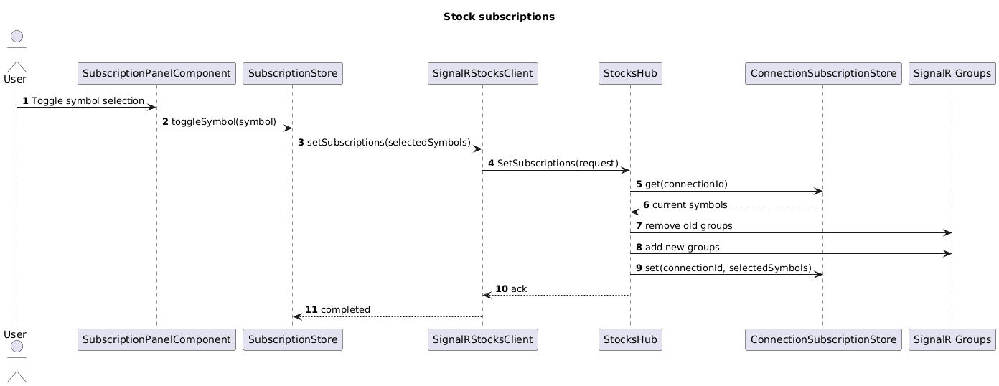

# 01 Stock Subscriptions

## Overview

This slice lets a user choose which symbols to watch and guarantees the frontend only receives quotes for those symbols.

The slice is intentionally simple:

- the frontend sends the full selected symbol set whenever it changes
- the backend diffs old and new selections
- SignalR groups are used for delivery targeting

This feature does not generate prices, load history, or derive ticker status.

## Feature Flow

1. The Angular app opens a SignalR connection.
2. The user selects or unselects symbols.
3. The Angular store sends the current symbol set to the hub.
4. The hub updates a per-connection subscription snapshot.
5. The hub adds and removes the connection from SignalR groups.
6. Later slices publish live quotes to those groups.

## Classes, Objects, and Types

### Backend

| Name | Kind | Responsibility |
| --- | --- | --- |
| `StockSymbolCatalog` | static class | Returns the fixed list of symbols available to the UI and tests. |
| `SetSubscriptionsRequest` | record | Carries the full selected symbol list from the client to the hub. |
| `ConnectionSubscriptionStore` | service | Stores the current symbol set per SignalR connection so the hub can diff changes. |
| `StocksHub` | SignalR hub | Accepts `SetSubscriptions`, updates groups, and clears connection state on disconnect. |

### Frontend

| Name | Kind | Responsibility |
| --- | --- | --- |
| `SubscriptionStore` | Angular injectable store | Holds `availableSymbols` and `selectedSymbols` as signals and calls the hub client when selections change. |
| `SignalRStocksClient` | service | Wraps the minimal SignalR client operations used by the app. |
| `SubscriptionPanelComponent` | standalone component | Displays the symbol list and calls the store when the user toggles a symbol. |
| `AvailableSymbol` | type | UI model for symbol code and display name. |

### Tests

| Name | Kind | Responsibility |
| --- | --- | --- |
| `ConnectionSubscriptionStoreTests` | backend unit test | Verifies add, replace, and remove behavior per connection. |
| `StocksHubTests` | backend integration-style test | Verifies group membership changes for a new symbol set. |
| `subscription-panel.component.spec.ts` | frontend component test | Verifies store updates when a symbol is toggled. |

## Expected Folder Structure

```text
src/
├── backend/
│   ├── TickerTime.Api/
│   │   └── Features/
│   │       └── stock-subscriptions/
│   │           ├── StockSymbolCatalog.cs
│   │           ├── SetSubscriptionsRequest.cs
│   │           ├── ConnectionSubscriptionStore.cs
│   │           └── StocksHub.cs
│   └── TickerTime.Api.Tests/
│       └── Features/
│           └── stock-subscriptions/
│               ├── ConnectionSubscriptionStoreTests.cs
│               └── StocksHubTests.cs
└── frontend/
    ├── ticker-time-ui/
    │   └── src/app/features/stock-subscriptions/
    │       ├── subscription.store.ts
    │       ├── signalr-stocks.client.ts
    │       ├── available-symbol.ts
    │       └── subscription-panel.component.ts
    └── ticker-time-ui-e2e/
        └── src/specs/stock-subscriptions/
            └── subscribe-symbols.spec.ts
```

## Sequence Diagram



Source: [stock-subscriptions-sequence.puml](./stock-subscriptions-sequence.puml)

## Simplicity Rules

- The client always sends the full symbol set. No partial subscribe or unsubscribe commands.
- The symbol catalog is fixed and in memory.
- Invalid symbols are ignored by the hub.
- Connection state is cleared on disconnect without persistence.

## Test Design

### Backend

- `ConnectionSubscriptionStoreTests` cover empty, replace, and remove flows.
- `StocksHubTests` use a fake `IGroupManager` and fake `HubCallerContext` to verify group diffs.

### Frontend

- `subscription-panel.component.spec.ts` verifies toggling a symbol updates the store and calls `SignalRStocksClient.setSubscriptions`.

### Playwright

- `subscribe-symbols.spec.ts` verifies subscribing to `SYM001` and `SYM002` only renders those rows once the live stream feature exists.
