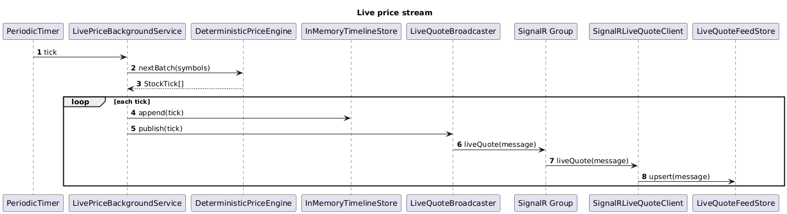

# 02 Live Price Stream

## Overview

This slice generates deterministic live quotes, stores them in memory, and pushes them to subscribed clients through SignalR.

The slice stays radically simple:

- one background service
- one deterministic price engine
- one in-memory timeline store
- one SignalR message shape

There is no external market feed and no durable storage.

## Feature Flow

1. A background service wakes on a fixed interval.
2. The price engine advances each configured symbol.
3. The timeline store appends the new tick.
4. The broadcaster publishes the quote to the matching SignalR group.
5. The frontend live feed store receives the quote and updates its latest state.

## Classes, Objects, and Types

### Backend

| Name | Kind | Responsibility |
| --- | --- | --- |
| `LivePriceBackgroundService` | hosted service | Uses `PeriodicTimer` to generate the next tick batch. |
| `DeterministicPriceEngine` | service | Produces the next price from a seeded symbol state. |
| `SymbolPriceState` | record | Holds the current price, sequence number, and seed state per symbol. |
| `StockTick` | record | A single quote point containing symbol, price, and UTC timestamp. |
| `InMemoryTimelineStore` | service | Appends ticks and exposes latest or historical windows. |
| `LiveQuoteMessage` | record | SignalR payload sent to clients for a single symbol update. |
| `LiveQuoteBroadcaster` | service | Sends `LiveQuoteMessage` to `Clients.Group(symbol)`. |

### Frontend

| Name | Kind | Responsibility |
| --- | --- | --- |
| `LiveQuoteFeedStore` | Angular injectable store | Holds the latest live quote by symbol as a signal map. |
| `SignalRLiveQuoteClient` | service | Registers the `liveQuote` SignalR handler and forwards messages to the store. |
| `LiveQuote` | type | Frontend shape matching `LiveQuoteMessage`. |

### Tests

| Name | Kind | Responsibility |
| --- | --- | --- |
| `DeterministicPriceEngineTests` | backend unit test | Verifies repeatable output for a seed and symbol. |
| `InMemoryTimelineStoreTests` | backend unit test | Verifies append order and window retrieval. |
| `live-quote-feed.store.spec.ts` | frontend unit test | Verifies latest quotes are replaced by symbol. |

## Expected Folder Structure

```text
src/
├── backend/
│   ├── TickerTime.Api/
│   │   └── Features/
│   │       └── live-price-stream/
│   │           ├── LivePriceBackgroundService.cs
│   │           ├── DeterministicPriceEngine.cs
│   │           ├── SymbolPriceState.cs
│   │           ├── StockTick.cs
│   │           ├── InMemoryTimelineStore.cs
│   │           ├── LiveQuoteMessage.cs
│   │           └── LiveQuoteBroadcaster.cs
│   └── TickerTime.Api.Tests/
│       └── Features/
│           └── live-price-stream/
│               ├── DeterministicPriceEngineTests.cs
│               └── InMemoryTimelineStoreTests.cs
└── frontend/
    └── ticker-time-ui/
        └── src/app/features/live-price-stream/
            ├── live-quote-feed.store.ts
            ├── signalr-live-quote.client.ts
            └── live-quote.ts
```

## Sequence Diagram



Source: [live-price-stream-sequence.puml](./live-price-stream-sequence.puml)

## Simplicity Rules

- The engine is deterministic. The same seed produces the same run.
- One tick equals one quote per symbol per interval.
- The timeline store is in memory only.
- The SignalR payload contains only the fields the UI needs.

## Test Design

### Backend

- `DeterministicPriceEngineTests` verify symbol movement is deterministic and bounded.
- `InMemoryTimelineStoreTests` verify the store keeps time order and caps history length when needed.

### Frontend

- `live-quote-feed.store.spec.ts` verifies incoming live quotes update the correct symbol entry without RxJS.
