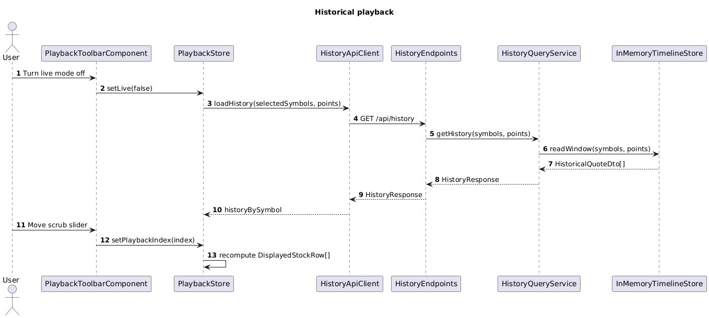

# 03 Historical Playback

## Overview

This slice lets the user leave live mode, fetch a small history window for the subscribed symbols, and scrub through time using a slider.

This slice is where the prototype defines the raw row that both investigation modes consume:

- `symbol`
- `displayedPrice`
- `referencePrice`
- `displayedAtUtc`

The status math is still not done here. This slice only decides which point in time is being displayed.

## Feature Flow

1. The user switches from live mode to history mode.
2. The frontend asks the backend for a timeline window for the current subscriptions.
3. The playback store keeps the history arrays in signals.
4. The user moves the slider.
5. The playback store computes the raw displayed rows from the selected index.
6. The status board slices read those raw rows and decide how to derive status.

## Classes, Objects, and Types

### Backend

| Name | Kind | Responsibility |
| --- | --- | --- |
| `HistoryEndpoints` | minimal API endpoint group | Exposes `GET /api/history` for the current symbol list. |
| `HistoryQueryService` | service | Reads history windows from `InMemoryTimelineStore`. |
| `HistoricalQuoteDto` | record | Serialized history point with symbol, price, and UTC timestamp. |
| `HistoryResponse` | record | Returns a `Dictionary<string, HistoricalQuoteDto[]>`. |

### Frontend

| Name | Kind | Responsibility |
| --- | --- | --- |
| `PlaybackStore` | Angular injectable store | Holds `isLive`, `playbackIndex`, `historyBySymbol`, and the computed raw displayed rows. |
| `HistoryApiClient` | service | Calls the backend history endpoint. |
| `PlaybackToolbarComponent` | standalone component | Hosts the live toggle and scrub slider. |
| `DisplayedStockRow` | type | Raw row consumed by the pipe and signal status boards. |
| `HistoricalQuote` | type | Frontend history point. |

### Tests

| Name | Kind | Responsibility |
| --- | --- | --- |
| `HistoryQueryServiceTests` | backend unit test | Verifies history windows are returned in time order and bounded by requested length. |
| `PlaybackStoreTests` | frontend unit test | Verifies live mode, history mode, and scrub index all produce the expected `DisplayedStockRow[]`. |
| `playback-toolbar.component.spec.ts` | frontend component test | Verifies slider changes call the store and update live mode. |

## Expected Folder Structure

```text
src/
├── backend/
│   ├── TickerTime.Api/
│   │   └── Features/
│   │       └── historical-playback/
│   │           ├── HistoryEndpoints.cs
│   │           ├── HistoryQueryService.cs
│   │           ├── HistoricalQuoteDto.cs
│   │           └── HistoryResponse.cs
│   └── TickerTime.Api.Tests/
│       └── Features/
│           └── historical-playback/
│               └── HistoryQueryServiceTests.cs
└── frontend/
    ├── ticker-time-ui/
    │   └── src/app/features/historical-playback/
    │       ├── playback.store.ts
    │       ├── history-api.client.ts
    │       ├── displayed-stock-row.ts
    │       ├── historical-quote.ts
    │       └── playback-toolbar.component.ts
    └── ticker-time-ui-e2e/
        └── src/specs/historical-playback/
            └── scrub-history.spec.ts
```

## Sequence Diagram



Source: [historical-playback-sequence.puml](./historical-playback-sequence.puml)

## Display Row Rule

`DisplayedStockRow` should be built like this:

- `displayedPrice`: the price at the chosen live or historical point
- `referencePrice`: the immediately previous point in that same symbol timeline
- `displayedAtUtc`: the timestamp of `displayedPrice`

This keeps the derivation target stable across both comparison modes.

## Simplicity Rules

- The history endpoint returns a fixed number of points and no pagination.
- The frontend loads history only when leaving live mode.
- Live quotes may continue to arrive while scrubbing, but they do not change the displayed rows until the user returns to live mode.

## Test Design

### Backend

- `HistoryQueryServiceTests` verify the correct number of points are returned for requested symbols.

### Frontend

- `PlaybackStoreTests` cover:
  - live rows from latest quotes
  - history rows from a slider index
  - fallback behavior when a reference point does not exist

### Playwright

- `scrub-history.spec.ts` verifies that moving the slider changes visible timestamps and prices while live mode stays off.
