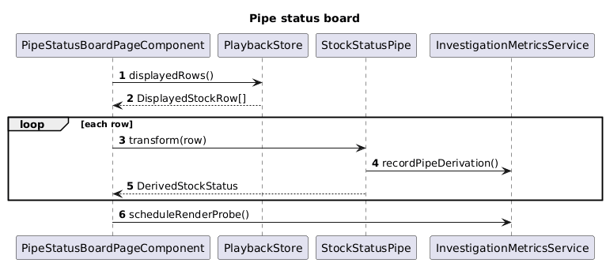

# 04 Pipe Status Board

## Overview

This slice implements the first investigation mode: derive ticker status in an Angular pipe during render.

The page consumes `DisplayedStockRow[]` from the historical playback slice and derives:

- `direction`
- `percentChange`
- `badgeTone`

The pipe version should do nothing else. It should not fetch data, manage history, or know about SignalR.

## Feature Flow

1. The page reads raw displayed rows from `PlaybackStore`.
2. The template evaluates `StockStatusPipe` for each row.
3. The pipe returns `DerivedStockStatus`.
4. The template renders the badge, arrow, and percentage.
5. The pipe records one derivation event in the investigation metrics service.

## Classes, Objects, and Types

### Frontend

| Name | Kind | Responsibility |
| --- | --- | --- |
| `PipeStatusBoardPageComponent` | standalone component | Route page for `/investigation/pipe`. Reads raw rows and renders the board. |
| `StockStatusPipe` | pure pipe | Converts `DisplayedStockRow` into `DerivedStockStatus`. |
| `DerivedStockStatus` | type | Contains `direction`, `percentChange`, and `badgeTone`. |
| `PipeBoardRowView` | type | View model used by the template when a raw row and derived status are combined locally. |
| `InvestigationMetricsService` | dependency | Records pipe transform counts and render timing probes. |

### Tests

| Name | Kind | Responsibility |
| --- | --- | --- |
| `stock-status.pipe.spec.ts` | frontend unit test | Verifies up, down, flat, and zero-reference behaviors. |
| `pipe-status-board.component.spec.ts` | frontend component test | Verifies the page renders the correct badge text and percentage. |

## Expected Folder Structure

```text
src/
└── frontend/
    ├── ticker-time-ui/
    │   └── src/app/features/pipe-status-board/
    │       ├── pipe-status-board-page.component.ts
    │       ├── stock-status.pipe.ts
    │       ├── derived-stock-status.ts
    │       └── pipe-board-row-view.ts
    └── ticker-time-ui-e2e/
        └── src/specs/pipe-status-board/
            └── pipe-status-board.spec.ts
```

## Sequence Diagram



Source: [pipe-status-board-sequence.puml](./pipe-status-board-sequence.puml)

## Derivation Rule

The pipe should use this exact logic:

- `delta = displayedPrice - referencePrice`
- `percentChange = referencePrice === 0 ? 0 : delta / referencePrice`
- `direction = delta > 0 ? "up" : delta < 0 ? "down" : "flat"`
- `badgeTone = direction === "up" ? "positive" : direction === "down" ? "negative" : "neutral"`

## Simplicity Rules

- Use one pipe only.
- Use `@let` in the template so each row executes the pipe once per render pass.
- Keep the page markup as close as possible to the signal page so the comparison stays fair.

## Test Design

- `stock-status.pipe.spec.ts` is the main correctness test for the formula.
- `pipe-status-board.component.spec.ts` verifies row rendering with a stub `PlaybackStore`.
- Playwright uses this route as the pipe baseline for the performance suite.
