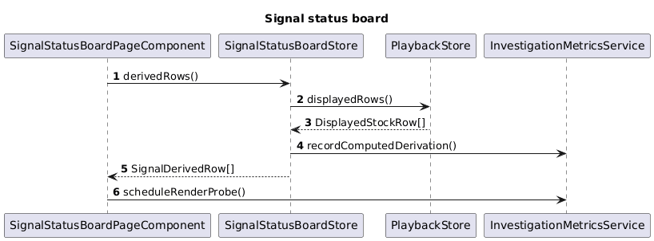

# 05 Signal Status Board

## Overview

This slice implements the second investigation mode: derive ticker status in a computed signal inside a store.

The page still consumes the same raw `DisplayedStockRow[]` produced by the playback slice. The only difference is that derivation moves out of the template and into a computed signal.

## Feature Flow

1. The page reads `derivedRows()` from `SignalStatusBoardStore`.
2. The store reads raw displayed rows from `PlaybackStore`.
3. The computed signal derives `direction`, `percentChange`, and `badgeTone`.
4. The page renders already-derived rows.
5. The store records one computed derivation event in the investigation metrics service.

## Classes, Objects, and Types

### Frontend

| Name | Kind | Responsibility |
| --- | --- | --- |
| `SignalStatusBoardStore` | Angular injectable store | Owns the computed signal that transforms raw rows into derived rows. |
| `SignalStatusBoardPageComponent` | standalone component | Route page for `/investigation/signal`. Renders derived rows only. |
| `SignalDerivedRow` | type | Combines raw row fields with the derived status fields. |
| `InvestigationMetricsService` | dependency | Records computed derivation counts and render timing probes. |

### Tests

| Name | Kind | Responsibility |
| --- | --- | --- |
| `signal-status-board.store.spec.ts` | frontend unit test | Verifies derived rows are recalculated from the raw playback rows. |
| `signal-status-board.component.spec.ts` | frontend component test | Verifies the page renders the same visible output as the pipe version. |

## Expected Folder Structure

```text
src/
└── frontend/
    ├── ticker-time-ui/
    │   └── src/app/features/signal-status-board/
    │       ├── signal-status-board.store.ts
    │       ├── signal-status-board-page.component.ts
    │       └── signal-derived-row.ts
    └── ticker-time-ui-e2e/
        └── src/specs/signal-status-board/
            └── signal-status-board.spec.ts
```

## Sequence Diagram



Source: [signal-status-board-sequence.puml](./signal-status-board-sequence.puml)

## Derivation Rule

The computed signal should use the same exact formula as the pipe version:

- `delta = displayedPrice - referencePrice`
- `percentChange = referencePrice === 0 ? 0 : delta / referencePrice`
- `direction = delta > 0 ? "up" : delta < 0 ? "down" : "flat"`
- `badgeTone = direction === "up" ? "positive" : direction === "down" ? "negative" : "neutral"`

## Simplicity Rules

- Use one computed signal for the page.
- Do not add memoization layers beyond Angular signals.
- Keep the page markup as close as possible to the pipe page so the comparison stays fair.

## Test Design

- `signal-status-board.store.spec.ts` verifies the computation from stub raw rows.
- `signal-status-board.component.spec.ts` verifies the visible board matches the pipe version for the same input data.
- Playwright uses this route as the signal baseline for the performance suite.
