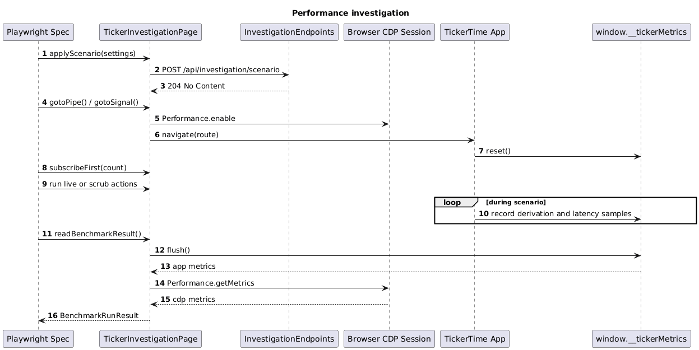

# 06 Performance Investigation

## Overview

This slice defines the benchmark harness, the app instrumentation, and the Playwright performance tests that compare:

- `/investigation/pipe`
- `/investigation/signal`

The goal is not to build a generic benchmark platform. The goal is to collect a small, repeatable result set for this one investigation.

## Benchmark Rules

- Both routes use the same backend scenario settings and the same selected symbols.
- The backend is reset between runs.
- The browser is reset between runs.
- The page object model drives both routes through the same user-level actions.
- Browser performance data is read through Chrome DevTools Protocol.

## Classes, Objects, and Types

### Backend

| Name | Kind | Responsibility |
| --- | --- | --- |
| `InvestigationScenarioSettings` | record | Holds `symbolCount`, `tickIntervalMs`, `historyPoints`, and `seed`. |
| `InvestigationScenarioStore` | service | Stores the active scenario so the live generator and history endpoint use the same settings. |
| `InvestigationEndpoints` | minimal API endpoint group | Exposes reset and scenario configuration endpoints for tests. |

### Frontend

| Name | Kind | Responsibility |
| --- | --- | --- |
| `InvestigationMetricsService` | Angular injectable service | Records derivation counts, inbound quote timestamps, render latency samples, and scrub latency samples. |
| `RenderProbeCoordinator` | service | Coalesces render probes and measures latency on the next animation frame. |
| `WindowTickerMetrics` | type | Shape exposed on `window.__tickerMetrics` for Playwright to read. |

### Playwright

| Name | Kind | Responsibility |
| --- | --- | --- |
| `TickerInvestigationPage` | page object | Main entry point for navigating to a route, subscribing symbols, switching live mode, and collecting results. |
| `SubscriptionPanelObject` | page object | Wraps symbol selection behavior. |
| `PlaybackToolbarObject` | page object | Wraps live toggle and scrub slider behavior. |
| `TickerGridObject` | page object | Reads the visible board rows and timestamps. |
| `CdpPerformanceSession` | support class | Uses CDP `Performance.enable` and `Performance.getMetrics` to capture browser metrics. |
| `pipe-vs-signal.performance.spec.ts` | Playwright spec | Runs the fixed scenarios for both routes and writes JSON results. |
| `BenchmarkRunResult` | type | Final merged output from app instrumentation and CDP metrics. |

## Expected Folder Structure

```text
src/
├── backend/
│   ├── TickerTime.Api/
│   │   └── Features/
│   │       └── performance-investigation/
│   │           ├── InvestigationScenarioSettings.cs
│   │           ├── InvestigationScenarioStore.cs
│   │           └── InvestigationEndpoints.cs
│   └── TickerTime.Api.Tests/
│       └── Features/
│           └── performance-investigation/
│               └── InvestigationEndpointsTests.cs
└── frontend/
    ├── ticker-time-ui/
    │   └── src/app/features/performance-investigation/
    │       ├── investigation-metrics.service.ts
    │       ├── render-probe-coordinator.ts
    │       └── window-ticker-metrics.ts
    └── ticker-time-ui-e2e/
        ├── src/page-objects/
        │   ├── ticker-investigation.page.ts
        │   ├── subscription-panel.object.ts
        │   ├── playback-toolbar.object.ts
        │   └── ticker-grid.object.ts
        ├── src/specs/performance/
        │   └── pipe-vs-signal.performance.spec.ts
        └── src/support/
            ├── cdp-performance-session.ts
            └── benchmark-run-result.ts
```

## Sequence Diagram



Source: [performance-investigation-sequence.puml](./performance-investigation-sequence.puml)

## Minimal Scenario Set

| Scenario | Route | Purpose |
| --- | --- | --- |
| `small-live` | both | Establish baseline behavior and verify instrumentation |
| `medium-live` | both | Main live comparison |
| `medium-scrub` | both | Compare latency while scrubbing |

## CDP Metrics

The Playwright support class should collect these metrics before and after each run and store deltas:

- `TaskDuration`
- `ScriptDuration`
- `LayoutDuration`

These are enough for this prototype. Do not add tracing, filmstrips, or complex profiling unless the simple metrics stop being useful.

## Page Object Model Design

`TickerInvestigationPage` should expose a narrow workflow API:

- `gotoPipe()`
- `gotoSignal()`
- `applyScenario(settings)`
- `subscribeFirst(count)`
- `enterHistoryMode()`
- `scrubTo(index)`
- `readBenchmarkResult()`

This keeps the spec readable and hides CSS selectors from the test body.

## Output Format

Each Playwright run should write one small JSON file to:

```text
artifacts/benchmarks/{scenario}-{mode}.json
```

The JSON should contain:

- scenario name
- mode
- symbol count
- tick interval
- derivation count
- median render latency
- p95 render latency
- median scrub latency
- `TaskDuration`
- `ScriptDuration`
- `LayoutDuration`

## Test Design

### Backend

- `InvestigationEndpointsTests` verify scenario changes and reset behavior.

### Frontend

- `InvestigationMetricsService` tests verify counters and sample aggregation.

### Playwright

- `pipe-vs-signal.performance.spec.ts` runs both routes with the same scenario configuration and writes results for later comparison.
